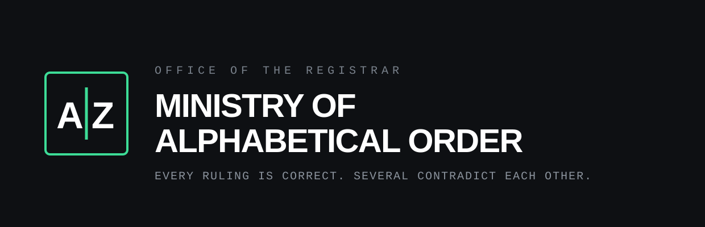

<p align="center">
  
</p>

<p align="center">
  <strong>Office of the Registrar.</strong><br>
  Every ruling is correct. Several of them contradict each other.
</p>

---

This repository contains the public site for the Ministry of Alphabetical
Order (alphabet.besteffortindustries.com), which rules on the order of
things and has never once been able to rule consistently.

## The finding

Sorting a list of words looks like the last settled question in computing.
It is not settled anywhere. The order depends on which alphabet is in use,
which country's convention is being followed, and whether the machine was
told either of those things before it started.

The Ministry's principal ruling concerns the letter I. Turkish has two of
them, and they are different letters: dotted `i` uppercases to dotted `İ`,
dotless `ı` uppercases to plain `I`. Lowercasing is therefore not a
universal operation. From that follow two premises and a conclusion the
Ministry did not go looking for:

1. Lowercase is a matter of nationality.
2. Lowercase is a matter of security.

Therefore lowercase is a matter of national security.

## What the site actually does

Everything runs client-side and none of the collation is simulated:

* **The bench** sorts one list under five jurisdictions at once, using
  `Intl.Collator` and the Unicode collation data the browser already ships.
  A curve joins each entry to itself across the orderings: green where a
  jurisdiction sorts it earlier, amber where it sorts it later, and nothing
  at all where it does not move. The crossings are the disagreement.
* **The principal ruling** folds one word on an English machine and on a
  Turkish one, shows that the two results are not equal, then presents the
  same word at a reserved-name gate. `ADMIN` folds to `admin` in one place
  and `admın` in the other, so the guard refuses it on one server and
  admits it on the other. That is a real bypass, and the reason platform
  guidance insists a case-insensitive comparison made for a security
  decision be ordinal or invariant, never locale-aware.
* **The schedule of standing contradictions** records six orderings that
  are each correct where they are used: Å, Ä and Ö after Z in Sweden; Ä as
  A or as AE in Germany, under two parts of one standard; Z between S and T
  in Estonia; CH after H in Czechia; CH and LL as letters in Spain until
  1994; and code point order, which no country uses and most software
  defaults to.

---

## Development notes

The parody ends here. The rest of this file is accurate.

### Layout

A static, zero-build, zero-dependency site. Two HTML files and a handful of
generated images. There is no framework, no bundler and no `package.json`.
Cloudflare Pages serves the repository root exactly as it appears here.

```
index.html            the site, bench and principal ruling included
404.html              catch-all, served automatically by Cloudflare Pages
favicon.svg           icon, generated from tools/favicon-src.svg with text outlined
favicon.ico           16/32/48, generated
apple-touch-icon.png  180x180, generated
og.png                1200x630 share image, generated
assets/logo.svg       wordmark, text outlined, used at the top of this README
tools/og.html         source for og.png
tools/logo-src.svg    source for assets/logo.svg, text still live
tools/favicon-src.svg source for favicon.svg, text still live
tools/favicon-16.svg  pixel-grid 16px icon, used for the smallest .ico entry
Makefile              asset regeneration only, never runs at deploy time
_headers              Cloudflare Pages header rules
robots.txt            permissive
wrangler.toml         Cloudflare Pages configuration
mise.toml             pins the Wrangler version used to deploy
```

The page makes zero requests to any external domain. All collation is done
by the visitor's own browser, so the disagreements on display are its
opinions rather than ours.

## The design

A contemporary standards body rather than an antique ministry: near-black
ground, a large tight display face, hairline rules, and a single emerald
accent used only where it carries meaning. The hero is a type specimen of
the four letter I's, because the page is about letterforms and the
letterforms explain the subject faster than the prose does.

Four decisions worth keeping:

* **The bench is a diagram, not a table.** It began as five columns of
  entries with the moved ones highlighted, which is a diff dump: fifty
  cells each stating a fact separately. Drawing a line from each entry to
  itself makes the disagreement visible as crossings, and colouring by
  direction says which way each jurisdiction moves it.
* **Nothing is drawn where nothing happens.** An entry that holds its
  position gets no connector and is set in grey. The earlier version drew a
  flat line for agreement, which read as a table rule and added noise in
  exactly the places with nothing to report.
* **The plot draws its own header.** The jurisdiction labels used to be
  HTML above the SVG. Two layout systems cannot be kept in alignment across
  a horizontal scroll, and the mismatch showed up as stray hairlines inside
  the header. Labels, column rules and entries now share one coordinate
  system, so nothing can drift.
* **The finding is stated first.** The headline carries the whole
  deduction, and the demonstrations below are its working. The panel at the
  end stamps the file rather than repeating the sentence.

### The production domain

The Ministry has no domain of its own, so its canonical host is a subdomain
of the parent: `alphabet.besteffortindustries.com`. That is the host every
absolute URL on the page points at, so link previews resolve. If the site
is ever promoted to a domain of its own, the canonical host changes in the
places below and nothing else derives it:

| File | What to change |
| --- | --- |
| `index.html` | `rel=canonical`, `og:url`, `og:image`, `twitter:image` |
| `404.html` | nothing, the 404 uses only root-relative paths |
| `tools/og.html` | the domain printed in the footer of the share image |
| `README.md` | this table, and the mentions above it |

After changing `tools/og.html`, re-run `make og`.

### Local preview

```sh
make serve          # python3 -m http.server 8000
```

Then open `http://localhost:8000`. A local server is preferable to opening
the file directly because the icon paths are root-absolute.

### Regenerating images

Only needed when the wordmark, the icon or the share image changes.
Requires `google-chrome`, ImageMagick 7 (`magick`) and Inkscape on the
machine doing the regenerating; none of them is needed to deploy, because
the outputs are committed. Helvetica and Courier New resolve through
fontconfig to Liberation Sans and Liberation Mono, which are
metric-compatible, so the rendered assets match what most non-Apple
visitors see in the browser.

```sh
make assets         # everything below
make og             # og.png     <- tools/og.html, via headless Chrome
make favicon        # favicon.svg (outlined) + favicon.ico + apple-touch-icon.png
make logo           # assets/logo.svg <- tools/logo-src.svg, text outlined
```

`make favicon` and `make logo` outline their text so the icon and the
wordmark render the same whether or not the viewer has the fonts. Inkscape
rewrites the whole file, so the `GENERATED` comment at the top has to be
pasted back afterwards.

### Deploying

Wrangler is configured via `wrangler.toml`, so a deploy is one command from
an authenticated shell:

```sh
make deploy         # wrangler pages deploy .
```

The Wrangler version is pinned by `mise.toml` (this machine manages its
Wrangler through [mise](https://mise.jdx.dev/); the global config tracks
`latest`, the repo pins an exact version). To move the pin, edit
`mise.toml`, run `mise install`, and deploy once to confirm nothing moved
underneath.

### Which Cloudflare account this deploys to

This machine has two Cloudflare identities, and picking the wrong one
deploys this site into an unrelated organisation.

**Pages configuration cannot pin the account.** `account_id` is a
Workers-only key; putting it in a Pages `wrangler.toml` makes Wrangler
refuse to run. So the account is selected by **an auth profile bound to
this directory**, recorded in
`~/.config/.wrangler/profiles/directory-bindings.json`:

```sh
wrangler auth activate personal    # already done; re-run after moving the repo
wrangler whoami                    # must print: Active profile: personal
```

Without a binding, Wrangler falls back to the `default` profile, which here
is the other organisation, and it will deploy there without asking. **Check
`whoami` before deploying.** The binding lives outside the repo, so a fresh
clone, a moved directory, or another machine all need `wrangler auth
activate` again.

One extra trap: Wrangler caches the resolved account in the untracked
`.wrangler/cache/wrangler-account.json` inside this directory. If a deploy
ever went to the wrong account from here, activating the right profile is
**not** enough; delete `.wrangler/` as well, or the cached account ID wins
and the API call fails with `Authentication error [code: 10000]`.

For CI, where profiles do not exist, set `CLOUDFLARE_ACCOUNT_ID` (the
account to deploy into) and `CLOUDFLARE_API_TOKEN` (credentials scoped to
it) as environment variables.

The Pages project is `alphabeticalorder`, production branch `main`, with no
build command and the build output directory set to `/`. If you ever
recreate it from the dashboard, use exactly those values; there is nothing
to build, and any build command entered there will only make the deployment
worse.

To wire the Git integration instead, connect the
`holthe/ministry-of-alphabetical-order` repository under **Workers & Pages
-> Create -> Pages -> Connect to Git** with the same settings.

### Custom domain

Deploy at least once first, so the project exists. Then, in the dashboard
under **Workers & Pages** -> `alphabeticalorder` -> **Custom domains** ->
**Set up a custom domain**, add `alphabet.besteffortindustries.com`. The
zone is already on Cloudflare, so the CNAME is created for you; do not
create the record by hand first, because a pre-existing record blocks the
flow. Universal SSL already covers one level of subdomain on that zone, so
the certificate needs no extra step.

Until the domain is attached the site is reachable at
`alphabeticalorder.pages.dev`.

### Related

The Ministry is a division of
[Best Effort Industries](https://besteffortindustries.com). The register
there is the only authority on division numbering, and this repository
deliberately records none: the site files itself as `BEI-MAO`, which is
derived from the Ministry's own name and cannot go stale when the register
renumbers.

## License

Parody. The Turkish letter I is real, the login failures are real, the
Swedish placement of Å, Ä and Ö is real, the two German conventions are
real, Estonia really does sort Z between S and T, Czechia really does treat
CH as one letter, Spain really did abolish CH and LL as sorting units in
1994, and the Ministry is the only party involved that never existed.
